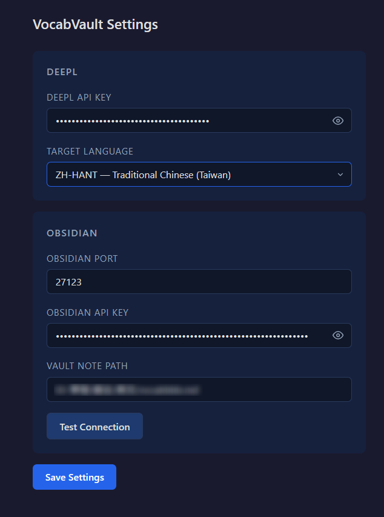
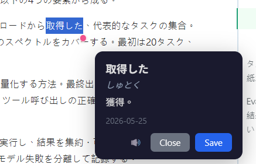

# VocabVault

Chromium based browser extension for capturing vocabulary from any webpage, translating it, and saving the result into an Obsidian note.

## Screenshots

|Settings Page|Popup Page|
|---|---|
|||

## Features

- Quick translate
- TTS Reading
- [JP] 平仮名 quick reference
- Saving to obsidian notes

### Install & Configure
#### 0. Install "Local REST API" extension for Obsidian"

#### 1. Load the extension zip to browser
#### 2. Open the extension settings page

- **DeepL API Key** - optional but recommended
- **Target Language** - defaults to `ZH-HANT`
- **Obsidian Port** - defaults to `27123`
- **Obsidian REST API Key**
- **Vault Note Path** - note file where entries are stored

Use **Test Connection** before saving settings.

## Language behavior

| Source language | Translation | Reading support | TTS |
| --- | --- | --- | --- |
| Japanese | Yes | Jisho reading lookup | Yes |
| English | Yes | No extra reading field | Yes |
| Chinese | Yes | No | No |
| Korean | Yes | No | No |
| German | Yes | No | No |
| French | Yes | No | No |
| Spanish | Yes | No | No |
| Unknown / unsupported | Best effort | No | No |

Chinese translation output follows the configured target variant:

- `ZH-HANT` → Traditional Chinese
- `ZH-HANS` → Simplified Chinese

## How it works

## Tech stack

- Chrome Extension Manifest V3
- Vanilla JavaScript, HTML, and CSS
- Chrome Extension APIs: `storage`, `contextMenus`, `activeTab`, messaging, options page, popup, content scripts
- DeepL API
- MyMemory Translation API
- Jisho API
- Obsidian Local REST API
- Browser `speechSynthesis` for TTS

## External services

- DeepL: `https://api-free.deepl.com/`
- MyMemory: `https://api.mymemory.translated.net/`
- Jisho: `https://jisho.org/`
- Obsidian Local REST API: `http://localhost:27123/`

## Todo 
- [ ] Optimize UI
- [ ] Flash card review
- [ ] Speed up
- [ ] HTTPS API suppport